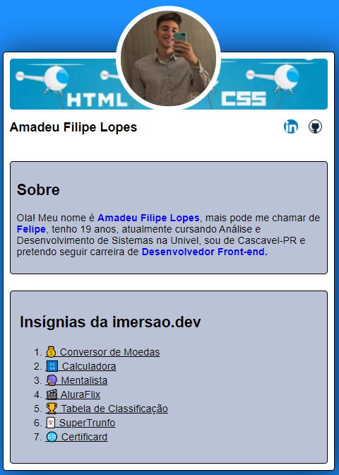

<h4 align="center"> 
	  Certificado Concluído 🚀 
</h4>

 <a href="https://codepen.io/felipelopes12/pen/jOyOezX">💰 Conversor de Moedas</a> •
 <a href="https://codepen.io/felipelopes12/pen/JjEoNMd">🔢 Calculadora</a> •
 <a href="https://codepen.io/felipelopes12/pen/VwPLGxq">🔮 Mentalista</a> • 
 <a href="https://codepen.io/felipelopes12/pen/abpvXGP">🎬 AluraFlix</a> • 
 <a href="https://codepen.io/felipelopes12/pen/eYgWGwa">🏆 Tabela de Classificação</a> • 
 <a href="https://codepen.io/felipelopes12/pen/YzNpLvq">🃏 SuperTrunfo</a> • 
 <a href="https://codepen.io/felipelopes12/pen/xxgdWmd">🌐 Certificard</a> • 
 

## 💻 Sobre o projeto

 imersão Dev - é uma experiência online com muito conteúdo prático, desafios onde o conteúdo fica disponível durante uma semana.

Projeto desenvolvido durante a **imersão Dev** oferecida pela [Alura](https://www.alura.com.br/).

A imersão DEV_ da Alura  é focada no aprendizado da linguagem JavaScript,guiando no processo de declaração de variáveis, objetos,
 laços condicionais, laços de repetição e funções, e em seu posterior uso dentro do código desenvolvido.
Além disso, para que cada projeto ficasse bem apresentável foi realizado um breve momento nos ajustes dos códigos HTML e CSS.
---

[Projeto original CodePen](https://codepen.io/felipelopes12/pen/xxgdWmd) 
⌨
Feito por Amadeu Filipe Lopes 👋🏽 [Entre em contato!](https://www.linkedin.com/in/amadeu-filipe-lopes12/)
⌨ 

